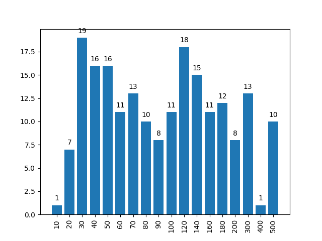
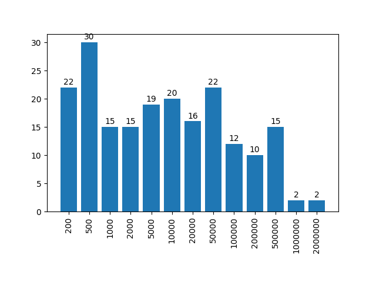

## Treedepth

- **Input:**  A connected undirected graph $G=(V,E)$
- **Output:**  A treedepth decomposition of $G$


### What is a treedepth decompositon?

Treedepth decomposition has many equivalent definitions. Here we mention two of them.

**Definition 1** 
: A *treedepth decomposition* of a connected graph $G=(V,E)$ is a rooted tree $T=(V,E_T)$ such that every edge of $G$ connects a pair of nodes that have an ancestor-descendant relationship in $T$. 

**Definition 2** 
:  A *treedepth  decomposition* of a connected graph $G=(V,E)$ is a rooted  tree  $T=(V,E_T)$ that can be obtained in the following recursive procedure. If $G$ has one vertex, then $T=G$. Otherwise pick a vertex $v\in V$ as the root of $T$, build a  treedepth  decomposition of each connected component of $G-v$ and add each of these decompositions to $T$ by making its root adjacent to $v$.

**Example**
: 

The *depth* of a tree is the maximum number of nodes in a root-leaf path in the tree. The *treedepth* of $G$ is a minimum depth of a treedepth decomposition of $G$.


## Tracks

 1. **Exact**: Compute a treedepth decomposition of minimum depth. You have 30 minutes per instance.  Contestants are ranked by number of instances solved and time required as a tiebreaker.
 2.  **Heuristic**: Compute some treedepth decomposition of decent depth. You have 30 minutes per instance. Contestants are ranked by the quality of their results.

## Detailed Submission Requirements 

[Submission Requirements](submissions.md)

## Exact Track

The implementation you submit should compute a treedepth decomposition of minimum depth. We anticipate submissions to be based on a provably optimal algorithm, although we do not make this a formal requirement. Instead, if your submission halts on some instance within the allotted time and does not output an optimal solution, the submission will be disqualified. If in your output the depth reported in the first line does not match the depth of the tree reported in the following lines, this is treated as a non-optimal solution.

There are 200 benchmark instances, labeled exact001.gr to exact200.gr. The instances are ordered lexicographically by non-decreasing (n,m) where n is the number of vertices and m is the number of edges. The odd instances are public and the even instances are secret. Graphs exact001.gr - exact176.gr have from 10 to 200 vertices and graphs exact177.gr - exact200.gr have from 201 to 500 vertices (see the histogram below).



You can download the **public instances** [here](/files/pace2020-exact-public.tgz)
and see them [here](/2020/visualize.html)

**Added on June 24, 2020:** download the **private instances** [here](/files/pace2020-exact-private.tgz)

**Ranking method** Contestants are ranked by number of instances solved and the total time required for the solved instances as a tiebreaker. For the final ranking only private instances are used.

For each instance, the available memory is limited to 8 GB and the size of the output that can be generated by the program is limited to 20 MB.

## Heuristic Track

The implementation you submit should compute a treedepth decomposition within 30 minutes. You do not need to implement a timer: your program will receive the Unix signal SIGTERM when the timeout is reached. When your process receives this signal, it must immediately print the current best solution to the standard output and then halt. You can find examples how to handle SIGTERM in several popular programming languages at this [optil.io page](https://www.optil.io/optilion/help/signals). If the process blocks for too long, say 30 seconds after the initial SIGTERM signal, we will forcefully stop it with SIGKILL. 

If in your output the depth reported in the first line does not match the depth of the tree reported in the following lines, this is treated as if the submission did not output a treedepth decomposition.

There are 200 benchmark instances, labeled heur001.gr to heur200.gr. The instances are ordered lexicographically by non-decreasing (n,m) where n is the number of vertices and m is the number of edges. The odd instances are public and the even instances are secret. The number of vertices is between 100 and 2,000,000 (see the histogram below) and the number of edges does not exceed 3,000,000.



You can download the **public instances** [here](/files/pace2020-heur-public.tgz) (55MB).

**Added on June 24, 2020:** download the **private instances** [here](/files/pace2020-heur-private.tgz)


**Ranking method** For each instance, your submission gets 100 * min / d points where d is the depth of the decomposition returned by the submission and min is the smallest width of the decomposition returned by any of the participants. When your submission does not return a treedepth decomposition, d is set to n (the number of vertices). The contestants are ranked by the total number of points for all instances. For the final ranking only private instances are used.

For each instance, the available memory is limited to 8 GB and the size of the output that can be generated by the program is limited to 20 MB.

## Appendix A: Input format (for both tracks)

The input graph is given via the standard input, which follows the DIMACS-like .gr file format described below.

Lines are separated by the character '\\n'. Each line that starts with the character c is considered to be a comment line. The first non-comment line must be a line starting with p followed by the problem descriptor tdp and the number of vertices n and edges m (separated by a single space each time). No other line may start with p. Every other line indicates an edge, and must consist of two decimal integers from 1 to n separated by a space; moreover, graphs are considered undirected. Isolated vertices, multiple edges, and loops are forbidden. It can be assumed that the graph is connected. For example, a path with four edges can be defined as follows:


```
c This file describes a path with five vertices and four edges.
p tdp 5 4
1 2
2 3
c we are half-way done with the instance definition.
3 4
4 5
```


## Appendix B: Output format (for both tracks)

The output tree should be given via the standard output, and should follow the .tree file format given below.

Tree description consists of n+1 lines, where n is the number of vertices in the tree. Lines are separated by the character '\\n'. The first line contains a single integer, namely the depth of the tree. Each of the following n lines consists of a single integer between 0 and n. For i=1,...n, if the number in the (i+1)-th line is 0, then i is the root of the tree. Otherwise, the number in the (i+1)-th line denotes the parent of vertex i in the tree. 

E.g., the following file
```
3
2
3
0
3
4
```
corresponds to the tree:
```
    3
   / \
  2   4
 /     \ 
1       5
```

## Appendix C: Validity checker (for both tracks)

Download [verify.cpp](/2020/verify.cpp). For a given graph G in the .gr format and tree T in .tree format it checks whether T is a treedepth decomposition of G (possibly with suboptimal depth).

Compile using 
```
g++ -std=c++14 verify.cpp -o verify -O3

```

Usage:
```
./verify graph_file.gr treedepth_decomposition.tree

```


