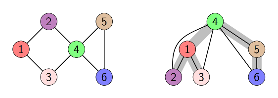

## Treedepth

- **Input:**  A connected undirected graph $G=(V,E)$
- **Output:**  A treedepth decomposition of $G$


#### What is a treedepth decompositon?

Treedepth decomposition has many equivalent definitions. Here we mention two of them.

**Definition 1** 
: A *treedepth decomposition* of a connected graph $G=(V,E)$ is a rooted tree $T=(V,E_T)$ such that every edge of $G$ connects a pair of nodes that have an ancestor-descendant relationship in $T$. 

**Definition 2** 
:  A *treedepth  decomposition* of a connected graph $G=(V,E)$ is every rooted  tree  $T=(V,E_T)$ that can be obtained in the following recursive procedure. If $G$ has one vertex, then $T=G$. Otherwise pick a vertex $v\in V$ as the root of $T$, build a  treedepth  decomposition of each connected component of $G-v$ and add all these decompositions to $T$ by joining their roots to $v$.

**Example**
: 

The *depth* of a tree is the maximum number of nodes in a root-vertex path in the tree. The *treedepth* of $G$ is a minimum depth of a treedepth decomposition of $G$.


## Tracks

 1. **Exact**: Compute a treedepth decomposition of minimum depth. You have 30 minutes per instance.  Contestants are ranked by number of instances solved and time required. Detailed ranking method TBA.
 2.  **Heuristic**: Compute some treedepth decomposition of decent depth. You have 30 minutes per instance. Contestants are ranked by quality of results and time required. Detailed ranking method TBA.

Detailed instructions and public instances will be published later.

## Detailed Submission Requirements for Implementations

TBA

## Appendix A: Input format (for both tracks)

The input graph is given via the standard input, which follows the DIMACS-like .gr file format described below.

Lines are separated by the character '\\n'. Each line that starts with the character c is considered to be a comment line. The first non-comment line must be a line starting with p followed by the problem descriptor tdp and the number of vertices n and edges m (separated by a single space each time). No other line may start with p. Every other line indicates an edge, and must consist of two decimal integers from 1 to n separated by a space; moreover, graphs are considered undirected. Isolated vertices, multiple edges, and loops are forbidden. It can be assumed that the graph is connected. For example, a path with four edges can be defined as follows:


```
c This file describes a path with five vertices and four edges.
p tdp 5 4
1 2
2 3
c we are half-way done with the instance definition.
3 4
4 5
```


## Appendix B: Output format (for both tracks)

The output tree should be given via the standard output, and should follow the .tree file format given below.

Tree description consists of n+1 lines, where n is the number of vertices in the tree. Lines are separated by the character '\\n'. The first line contains a single integer, namely the depth of the tree. Each of the following n lines consists of a single integer between 0 and n. For i=1,...n, if the number in the (i+1)-th line is 0, then i is the root of the tree. Otherwise, the number in the (i+1)-th line denotes the parent of vertex i in the tree. 

E.g., the following file
```
3
2
3
0
3
4
```
corresponds to the tree:
```
    3
   / \
  2   4
 /     \ 
1       5
```

## Appendix C: Validity checker (for both tracks)

Download [verify.cpp](/2020/verify.cpp). For a given graph G in the .gr format and tree T in .tree format it checks whether T is a treedepth decomposition of G (possibly with suboptimal depth).

Compile using 
```
g++ -std=c++14 verify.cpp -o verify -O3

```

Usage:
```
./verify graph\_file.gr treedepth\_decomposition.tree

```


