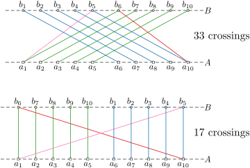

This year's challenge is about the one-sided crossing minimization problem (OCM).
This problem involves arranging the nodes of a bipartite graph on two layers (typically horizontal), with one of the layers fixed, aiming to minimize the number of edge crossings.
OCM is one of the basic building block used for drawing [hierarchical graphs](https://doi.org/10.1109%2FTSMC.1981.4308636). It is [NP-hard](https://doi.org/10.1016/0304-3975(94)90179-1), even [for trees](https://arxiv.org/abs/2306.15339), but admits good heuristics, can be [constant-factor approximated](https://doi.org/10.1007/BF01187020) and solved in [FPT time](https://doi.org/10.1007/s00453-004-1093-2). 
For an extended overview, see [Chapter 13.5 of the Handbook of Graph Drawing](https://cs.brown.edu/people/rtamassi/gdhandbook/chapters/hierarchical.pdf).

### Results of the Challenge

We are happy to announce the [results of PACE 2024](./results). Congratulations to the winners and all the participants!

### Challenge Description

The goal of this year's challenge is to compute a 2-layered drawing of a bipartite graph, where one side is fixed, with a minimum number of crossings. More precisely: 

**Input:** A bipartite graph $G=((A\dot\cup B),E)$, and a linear order of $A$.  
**Output:** A linear order of $B$.  
**Measure:** The number of edge crossings in a straight-line drawing of $G$ with $A$ and $B$ on two parallel lines, following their linear order.

See an example here with two different linear orders for $B$.

### Tracks

This year, we will have *three* tracks: 
- one focusing on **Exact** algorithms for instances with "few" crossings
- one for **Heuristic** algorithms for instances that might require many crossings
- one for exact **Parameterized** algorithms for instances with small [cutwidth](https://en.wikipedia.org/wiki/Cutwidth).

#### The Exact Track

The task is to compute an optimal solution for each given graph, that
is, a linear order of $B$ that *minimizes the number of crossings*. For each instance, the
solver has to output a solution within a time limit of <em
style="color:#db8a00">30 minutes</em> and a memory limit of <em
style="color:#db8a00">8 GB</em>.

Instances in this track have solutions where the number of crossings 
is *not too large* compared to the number of vertices. We give some
bounds on the crossing numbers for all instances on the
[properties](./properties) page.

Submissions should be based on provably optimal algorithms, however,
this is *not* a formal requirement. Submissions that output an
*incorrect* solution or a solution that is known to be *non-optimal*
will be **disqualified**. Besides dedicated algorithms, we also
encourage submissions based on other paradigms such as SAT, MaxSAT,
or ILPs.

#### The Heuristic Track

In this track, the solver shall compute a *good* solution
*quickly*. The solver will be run on each instance for <em
style="color:#db8a00">5 minutes</em> and receives the Unix signal
SIGTERM afterwards. When receiving this signal, the process has to
output a linear order of $B$ immediately to the standard
output and terminate. If the program does not halt in a reasonable
time after reserving the signal, it will be stopped via SIGKILL. In
this case the instance is counted as *time limit exceeded*. 
Information on how to handle Unix signals in various
programming languages can be found on the [optil.io webpage](https://www.optil.io/optilion/help/signals). 
The memory limit for this track is <em style="color:#db8a00">8 GB</em> as well.

For this track solutions do *not* have to be optimal. However, solvers
that produce *incorrect* solution will be **disqualified**.

#### Parameterized Track

This track has the same rules as the Exact Track. 
However, the instances here can require a large number of crossings,
but they have small [cutwidth](https://en.wikipedia.org/wiki/Cutwidth):
there is an ordering of the vertices of the graph, such that every cut obtained by 
partitioning the vertices into earlier and later subsets of the ordering is crossed 
by at most $k$ edges. Note that in this order the vertices of $A$ and $B$ might
be interleaved. An ordering that achieves minimum cutwidth 
**where the order of the vertices in $A$ is the same as in the problem instance**
will be provided together with the graph.

### Benchmark Sets

There will be four benchmark set:

1. A *tiny set* for debugging that contains graphs together with their
   one-sided crossing number.   
   We created a [public GitHub repository](https://github.com/PhKindermann/Pace2024-Testsets/tree/main)
   for interesting testing instances that also contains a test set with medium sized graphs
   (larger than in the tiny set but smaller than in the other benchmark sets).
   Feel free to contribute your own interesting test instances!
   - [instances](./tiny_test_set.zip)
   - [solutions](./tiny_test_set-sol.zip)
   - [images](./tiny_test_set-overview.pdf)   
   - [optil.io](https://www.optil.io/optilion/problem/3209)
3. The *exact set* containing 200 instances divided into 100
   public instances for development and 100 private instances used for
   evaluation.
   - [public instances](./exact-public.zip) + [solutions](./exact-public.zip)
   - [private instances](./exact-private.zip) + [solutions](./exact-private.zip)
   - [properties](./properties)
   - [optil.io](https://www.optil.io/optilion/problem/3210)
4. The *heuristic set* containing 200 instances divided into 100
   public instances for development and 100 private instances used for evaluation.
   - [public instances](./heuristic-public.zip)
   - [private instances](./heuristic-private.zip)
   - [optil.io](https://www.optil.io/optilion/problem/3212)
5. The *parameterized set* containing 200 instances divided into 100
   public instances for development and 100 private instances used for
   evaluation.
   - [public instances](./cutwidth-public.zip) + [solutions](./cutwidth-public.zip)
   - [private instances](./cutwidth-private.zip) + [solutions](./cutwidth-private.zip)
   - [optil.io](https://www.optil.io/optilion/problem/3211)
   
   
### Final Evaluation

The final score will be computed over all public and private instances (for the parameterized track,
we use a selection of 100 public instances, which are the ones provided on optil.io).

Since the hardware on optil.io is not reliable and can provide different results
upon uploading the same solver, we will compute the final score on our own hardware.
Note that this hardware is slightly stronger than the one on optil.io:
They use [Intel(R) Xeon(R) CPU E5-2695 v3 computing cores at 2.30GHz](https://www.optil.io/optilion/environment),
while we will use Intel(R) Xeon(R) Gold CPU 6342 computing cores at 2.80GHz.

Note also that the [optil.io](https://www.optil.io) platform ranking differs for the
heuristic track. The correct score can be seen on the [results](./results) page.

   
### Details

- [**Input and Output Format**](./io)     
- [**Verifier and Tester**](./verifier)     
- [**Visualizer**](./visualizer)     
- [**Scoring Methods**](./scoring)     
- [**Submission Requirements**](./submissions)
- [**Results**](./results)

### Timeline

- [x] September 2023: Announcement of the Challenge.
- [x] November 2023: Definition of the input and output format. 
  - [x] A [tiny test set](./tiny_test_set.zip) will be provided.
  - [x] A [verifier](./verifier) will be provided.
  - [x] A [visualizer](./visualizer) will be provided.
- [x] December 2023: Announcement of the ranking methods.
  - [x] An [autotester](./verifier) (like a JUnit test) will be provided.
- [x] Early February 2024: Public instances and details about the benchmark set get published.
  - [x] Additional information about the submission process get published.
  - [x] A [repository](https://github.com/PhKindermann/Pace2024-Testsets/tree/main) for public test instances will be provided.
- [x] April 2024: Submission opens with public leaderboard.
- [x] May 20th, 2024: The public leaderboard gets frozen.
- [x] June 2024: Submission Deadline.
	- [x] June 9th, 2024 (AoE): Submission deadline for solver.
	- [x] June 23rd, 2024 (AoE): Submission deadline for solver description.
- [x] July 2024: Announcement of the Results.
- [ ] IPEC 2024: Award ceremony.

### Zulip

Join us on [Zulip](https://pacechallenge.zulipchat.com/join/prysn4f3rn7grsxgmbx6vkfg/)
for discussions and updates.

### Program Committee

- [Philipp Kindermann](https://algo.uni-trier.de/~kindermann) (Universität Trier, chair)
- [Fabian Klute](https://fklute.com/) (UPC Barcelona)
- [Soeren Terziadis](https://www.ac.tuwien.ac.at/people/sterziadis/) (TU Eindhoven)
