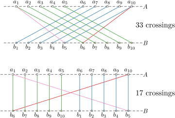

This year's challenge is about the one-sided crossing minimization problem (OCM).
This problem involves arranging the nodes of a bipartite graph on two layers (typically horizontal), with one of the layers fixed, aiming to minimize the number of edge crossings.
OCM is one of the basic building block used for drawing [hierarchical graphs](https://doi.org/10.1109%2FTSMC.1981.4308636). It is [NP-hard](https://doi.org/10.1016/0304-3975(94)90179-1), even [for trees](https://arxiv.org/abs/2306.15339), but admits good heuristics, can be [constant-factor approximated](https://doi.org/10.1007/BF01187020) and solved in [FPT time](https://doi.org/10.1007/s00453-004-1093-2). 
For an extended overview, see [Chapter 13.5 of the Handbook of Graph Drawing](https://cs.brown.edu/people/rtamassi/gdhandbook/chapters/hierarchical.pdf).

### Challenge Description

The goal of this year's challenge is to compute a 2-layered drawing of a bipartite graph, where one side is fixed, with a minimum number of crossings.
for a given graph of small width. More precisely: 

**Input:** A bipartite graph $G=((A\dot\cup B),E)$, and a linear order of $A$.  
**Output:** A linear order of $B$.  
**Measure:** The number of edge crossings in a straight-line drawing of $G$ with $A$ and $B$ on two parallel lines, following their linear order.

See an example here with two different linear orders for $B$.

### Tracks

As in previous incarnations of the challenge, we will have *two*
tracks: One focusing on **Exact** algorithms and one for **Heuristic**
solutions. 

#### The Exact Track

The task is to compute an optimal solution for each given graph, that
is, a linear order of $B$ that *minimizes the number of crossings*. For each instance, the
solver has to output a solution within a time limit of <em
style="color:#db8a00">30 minutes</em> and a memory limit of <em
style="color:#db8a00">8 GB</em>.

Submissions should be based on provably optimal algorithms, however,
this is *not* a formal requirement. Submissions that output an
*incorrect* solution or a solution that is known to be *non-optimal*
will be **disqualified**. Besides dedicated algorithms, we also
encourage submissions based on other paradigms such as SAT, MaxSAT,
or ILPs.

#### The Heuristic Track

In this track, the solver shall compute a *good* solution
*quickly*. The solver will be run on each instance for <em
style="color:#db8a00">5 minutes</em> and receives the Unix signal
SIGTERM afterwards. When receiving this signal, the process has to
output a correct contraction sequence immediately to the standard
output and terminate. If the program does not halt in a reasonable
time after reserving the signal, it will be stopped via SIGKILL. In
this case the instance is counted as *time limited exceeded*. 
Information on how to handle Unix signals in various
programming languages can be found on the [optil.io webpage](https://www.optil.io/optilion/help/signals). 
The memory limit for this track is <em style="color:#db8a00">8 GB</em> as well.

For this track solutions do *not* have to be optimal. However, solvers
that produce *incorrect* solution will be **disqualified**.

#### Parameterized Track

TBA

### Benchmark Sets

There will be four benchmark set:

1. A *tiny set* for debugging that contains graphs together with their
   twinwidth. On optil.io this set as a time limit of 
   <em style="color:#db8a00">60 seconds</em> and memory limit of 
   <em style="color:#db8a00">100 Kb</em>.
2. The *exact set* containing 200 instances divided into 100
   public instances for development and 100 private instances used for
   evaluation.
3. The *heuristic set* containing 200 instances divided into 100
   public instances for development and 100 private instances used for evaluation.
2. The *parameterized set* containing 200 instances divided into 100
   public instances for development and 100 private instances used for
   evaluation.
   
### Details

- [**Input and Output Format**](./io)     
- [**Scoring Methods**](./scoring)     
- [**Submission Requirements**](submissions)

### Evaluation

The final evaluation will be done on a local machine by the Program Committee,
to remove inconsistencies in the performance of [optil.io](www.optil.io).

### Timeline

- September 2023: Announcement of the Challenge
- October 2024: Definition of the input and output format. 
  - A tiny test set will be provided.
  - A verifier will be provided.
  - A visualizer will be provided.
- November 2024: Announcement of the ranking methods and additional
  information about the submission process.
- January 2024: Public instances and details about the benchmark set
  get published.
- March 2024: Submission on [optil.io](www.optil.io) opens with public
  leaderboard.
- May 2024: The public leaderboard gets frozen.
- June 2024: Submission Deadline.
	- June 1st, 2024 (AoE): Submission deadline for solver.
	- June 15th, 2024 (AoE): Submission deadline for solver description.
- July 2024: Announcement of the Results.
- IPEC 2024: Award ceremony.

### Program Committee

- [Philipp Kindermann](https://algo.uni-trier.de/~kindermann) (Universität Trier, chair)
- [Fabian Klute](https://fklute.com/) (UPC Barcelona)
- [Soeren Terziadis](https://www.ac.tuwien.ac.at/people/sterziadis/) (TU Eindhoven)
